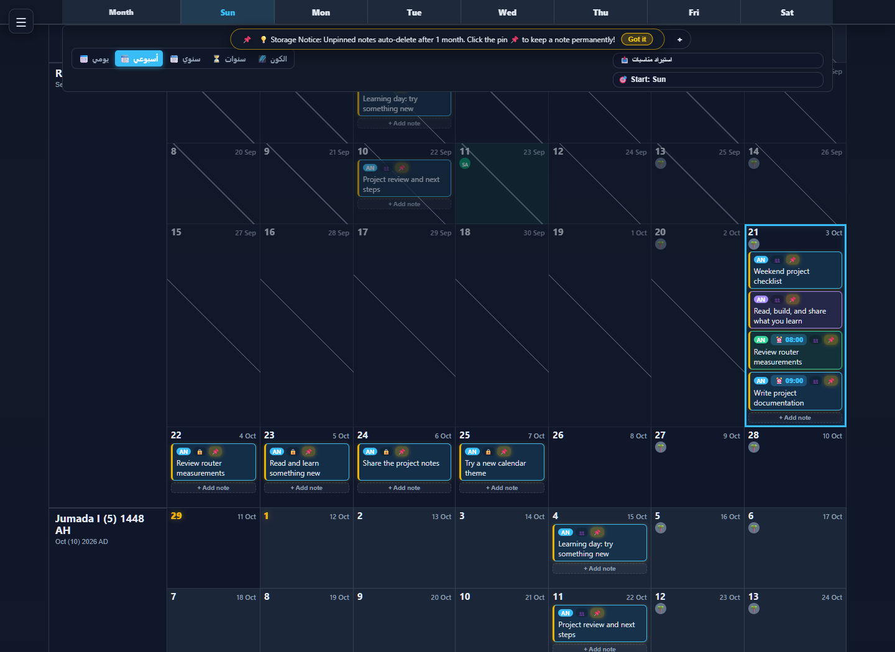
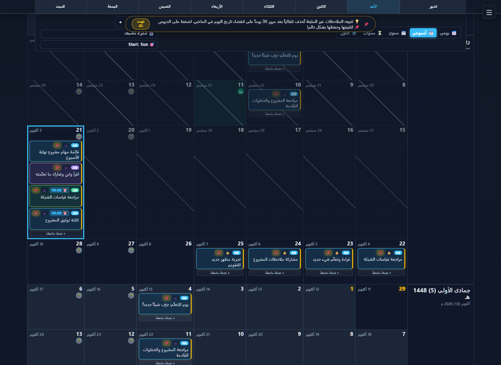
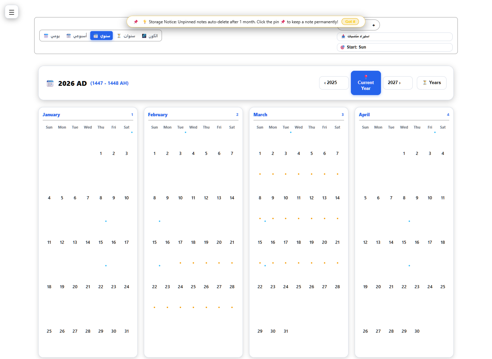
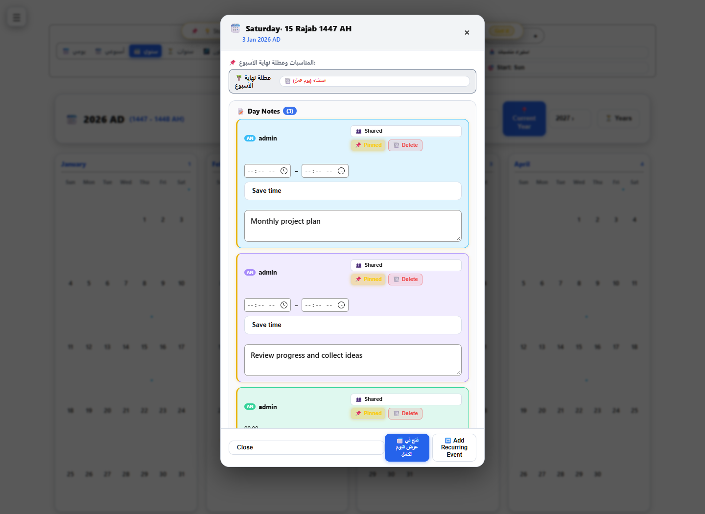
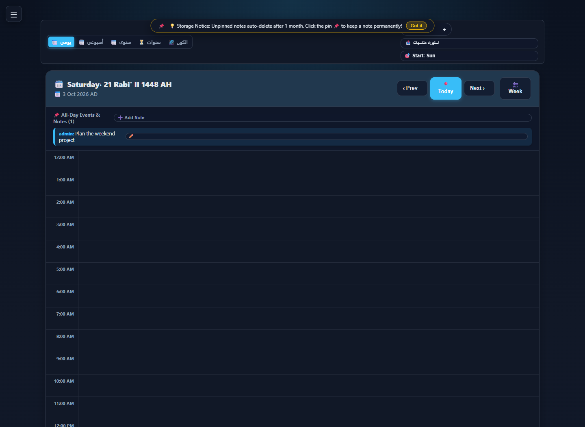
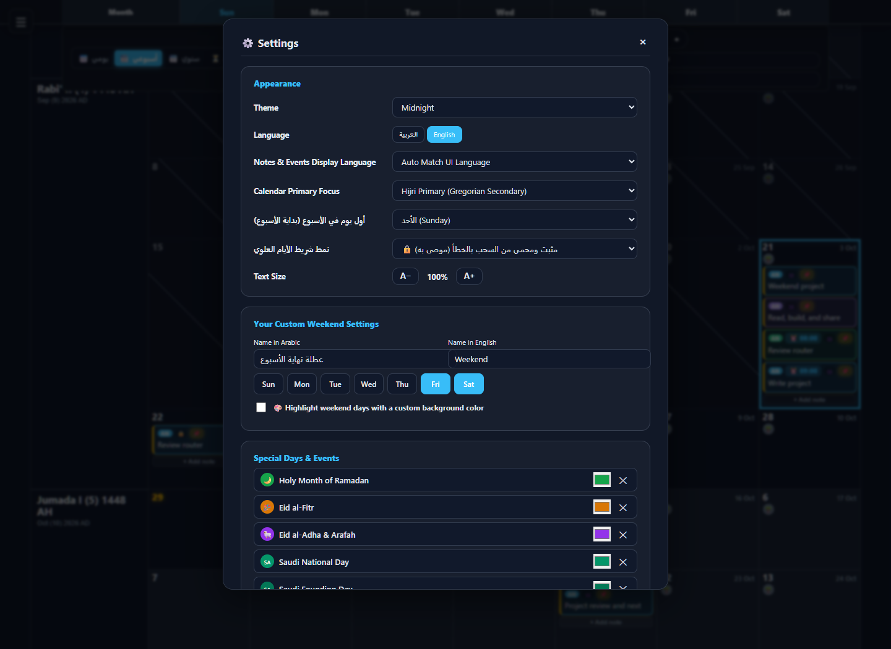

# Continuous Calendar

**A self-hosted, continuous calendar with Arabic and English interfaces, shared notes, recurring events, and a small Node.js backend.**

This project began from Evan Wallace's [Continuous Calendar](https://madebyevan.com/calendar/): scroll through weeks, click a day, and write a note. It grew into a household calendar while keeping that direct interaction at its center.



<details>
<summary>More screenshots: daily, weekly, and yearly views with sample notes, plus settings</summary>

**Arabic weekly view with sample notes**



**Yearly view with marked note days in the light theme**



**Yearly overview with the day-note panel open**



**Daily planner with all-day and timed sample notes**



**Language, theme, weekend, and calendar settings**



These captures use synthetic notes in an isolated local instance. See the [screenshot gallery](screenshots/README.md) for capture details.

</details>

## AI assistance and feedback

AI generated most of the project-specific code and documentation. I brought the needs, tried things on my own setup, and shared the results to guide the work. I'm still learning, and there may be mistakes or better approaches I haven't discovered. Existing projects and libraries are credited separately.

Suggestions, corrections, alternative solutions, and any helpful notes are welcome. Please [open an issue](https://github.com/Ananas0dev/continuous-calendar/issues) or send a pull request—even pointing me toward an existing tool or explaining a better way would help.

## Features in the recovered application

- Continuous week scrolling and notes, with Arabic/English display settings.
- User registration, an approval queue, administrator controls, and browser sessions.
- Shared/private note permissions, pinned notes, recurring events, and incremental synchronization.
- Gregorian/Hijri indicators, configurable weekends, themes, and display controls.
- Shared household needs with user-added categories, admin-managed category edits/removal, per-item deadlines, and shared calendar links.
- A local 3D space explorer with Earth, solar-system, galaxy, and illustrative cosmic-web views.
- Import/export helpers, including external spreadsheet and PDF libraries.

## Run locally

Use Node.js 20 or newer. The backend uses only built-in Node modules; no npm installation is required.

In PowerShell, set a private first-run password without placing it in shell history:

```powershell
$env:CALENDAR_ADMIN_PASSWORD = Read-Host 'New admin password (12+ characters)' -MaskInput
node server/server.js
```

In Bash:

```sh
read -rs -p 'New admin password (12+ characters): ' CALENDAR_ADMIN_PASSWORD
export CALENDAR_ADMIN_PASSWORD
node server/server.js
```

Open <http://127.0.0.1:3000/> and sign in as `admin` using that password. The password initializes a **new** database only; changing the environment variable does not reset an existing account. Runtime data goes in ignored `data/db.json`, or `CALENDAR_DATA_FILE` if supplied.

## Deployment and status

This is a recovered household application, prepared for public source review. It is intended for trusted local use. Read [security limitations](SECURITY.md) before hosting it. The public copy removes embedded admin credentials and shared-PIN access, uses random session tokens, and refuses to silently replace an unreadable database. Those changes have not been deployed onto the original server.

[Self-hosting](docs/self-hosting.md) · [Architecture](docs/architecture.md) · [Data format](docs/data-format.md) · [Design goals](docs/design-goals.md) · [Roadmap](docs/roadmap.md) · [Changes](CHANGELOG.md)

## Origins and credits

Evan Wallace's 2010 calendar is the project's starting point, not an original interface invented here. The recovered deployment has no complete source-control history, so the exact boundary between reused and rewritten code cannot be reconstructed reliably. His [MIT notice](third-party/evan-wallace-MIT.txt) is preserved, along with the notices for bundled Three.js. See [NOTICE.md](NOTICE.md) for external libraries and licensing scope.

## License

Original project code and documentation are licensed under [GNU GPL version 3](LICENSE) (`GPL-3.0-only`). Third-party components retain their own licenses and notices in [NOTICE.md](NOTICE.md).
