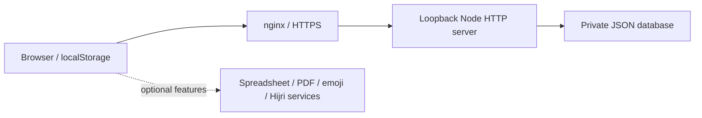

# Architecture

`client/index.html` is the recovered single-file client: styles, interface, calendar logic, and a bundled Three.js visual component. It is intentionally retained as one file to preserve the working application before any later refactor.

`server/server.js` uses Node's HTTP, filesystem, path, URL, and crypto modules. It serves the client and a JSON API, holds state in memory, and persists to a JSON file. The recovered package manifest listed Express and CORS, but the server imports neither; those unused dependencies were removed from this public package.

API areas include `/api/auth/*`, `/api/admin/*`, `/api/notes`, `/api/recurring-events`, `/api/indicators`, and `/api/sync`. The frontend uses same-origin absolute `/api/` URLs; preserve that route when deploying at `/calendar/`.

Browser localStorage stores preferences, sessions, and cached calendar state. External integrations are present in the recovered client; this is not a fully offline application. A minimal manifest and network-only service worker were added because the server expected those files but they were absent from the recovered directory.
